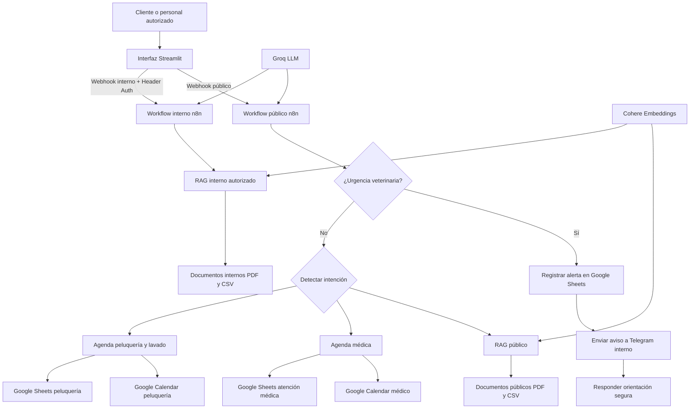
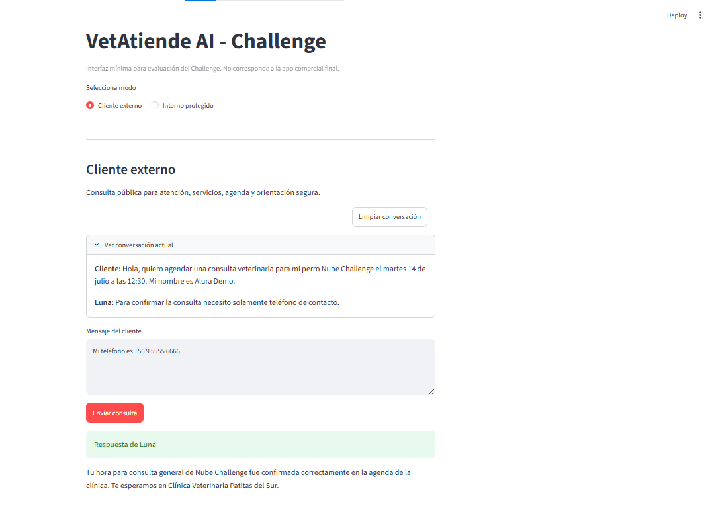
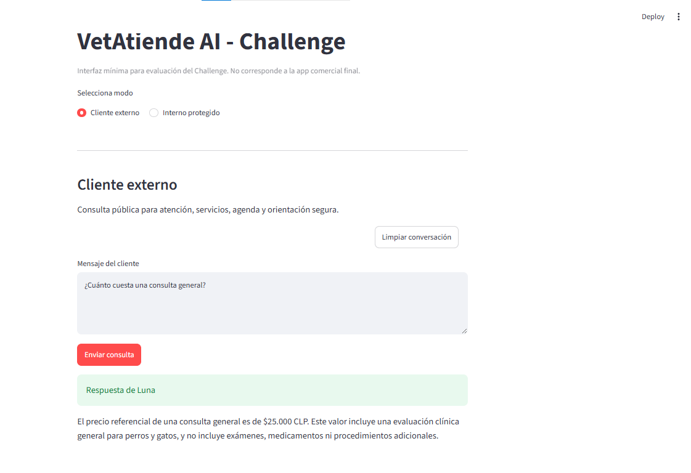
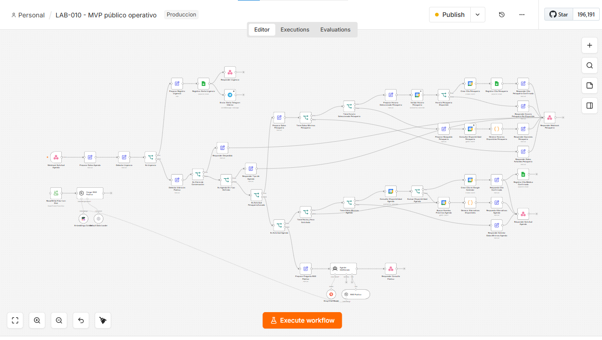
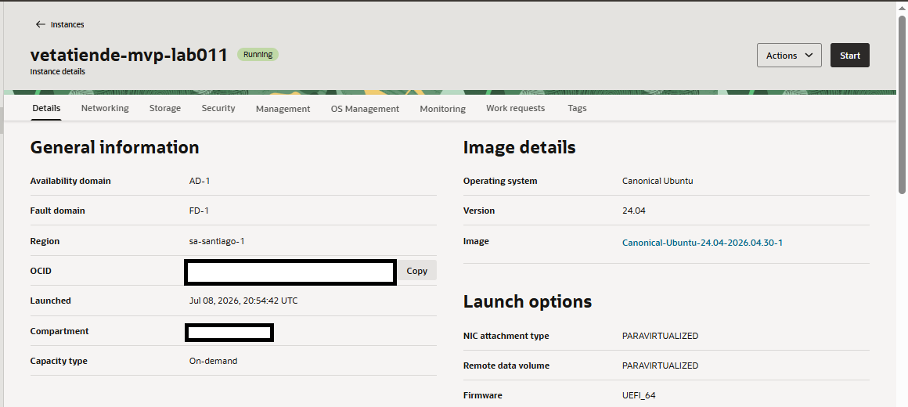

# VetAtiende AI

Asistente operacional con inteligencia artificial para clínicas veterinarias pequeñas y medianas.

VetAtiende AI fue desarrollado para el Challenge de Agentes de IA de Alura/ONE y como base de un MVP comercial capaz de atender consultas, gestionar agendas, proteger información interna y activar alertas ante urgencias veterinarias.

La solución utiliza una clínica ficticia pero realista, **Clínica Veterinaria Patitas del Sur**, ubicada en Purranque, Chile. Su asistente virtual se llama **Luna**.

> **Estado actual:** MVP operativo validado. El backend de automatización n8n fue desplegado en Oracle Cloud Infrastructure y la interfaz Streamlit incluida en el repositorio corresponde a la versión de evaluación del Challenge, no a la aplicación comercial definitiva.

## Demo pública interactiva

**[Abrir VetAtiende AI en Streamlit](https://vetatiende-ai-nwg6exgqvha5zst2fyvpxw.streamlit.app/)**

La demo pública permite probar de forma segura:

- consultas sobre servicios, precios y horarios mediante RAG público;
- solicitudes simuladas de agenda médica;
- solicitudes simuladas de peluquería y lavado;
- orientación segura ante posibles urgencias veterinarias;
- continuidad básica de la conversación durante la sesión.

> **Importante:** las citas presentadas en esta demo son simuladas. No crean reservas reales, no bloquean horarios, no registran datos en la clínica y no envían alertas al personal veterinario. El canal interno protegido no está disponible públicamente.

La demo utiliza un workflow n8n separado del MVP operativo. Las integraciones reales con Google Calendar, Google Sheets y Telegram permanecen únicamente en los workflows operativos protegidos.


---

## 1. Problema que resuelve

Las clínicas veterinarias reciben diariamente consultas repetitivas sobre:

- horarios de atención;
- servicios y precios;
- vacunación y controles;
- disponibilidad de consultas;
- peluquería y lavado;
- farmacia y Pet Shop;
- preparación para procedimientos;
- urgencias veterinarias;
- protocolos internos.

Cuando estas tareas se gestionan manualmente, el equipo pierde tiempo, las respuestas pueden ser inconsistentes y existe riesgo de mezclar información pública con procedimientos internos.

VetAtiende AI centraliza estos procesos mediante:

- respuestas sustentadas en documentos oficiales;
- separación entre información pública e interna;
- agendas conectadas a disponibilidad real;
- registros operativos en Google Sheets;
- detección y aviso activo de urgencias;
- una interfaz web sencilla para clientes y personal autorizado.

---

## 2. Funcionalidades principales

### 2.1 Atención pública con RAG

Luna responde consultas usando documentos públicos de la clínica y evita inventar información que no esté respaldada.

Puede responder sobre:

- horarios;
- servicios;
- precios referenciales;
- vacunación;
- atención general;
- peluquería y lavado;
- farmacia y Pet Shop presencial;
- seguridad y derivación veterinaria.

Las ventas, reservas de productos, pagos y despachos de farmacia o Pet Shop no forman parte del MVP.

### 2.2 Canal interno protegido

El sistema dispone de un flujo separado para consultas del personal autorizado.

Este canal:

- utiliza documentación interna diferente;
- requiere una clave enviada mediante un encabezado HTTP;
- no expone procedimientos internos a clientes externos;
- devuelve `403 Prohibido` cuando no se presenta la autorización correcta.

Ejemplos de información interna:

- protocolo ante sospecha de contagio;
- procedimientos de recepción;
- registro de faltas de stock;
- preparación administrativa para procedimientos.

### 2.3 Agenda médica

El flujo público puede:

- detectar intención de agendar;
- extraer tutor, mascota, teléfono, fecha y hora;
- consultar disponibilidad real en Google Calendar;
- ofrecer tres alternativas disponibles;
- interpretar expresiones habituales en Chile;
- evitar reservas duplicadas;
- crear citas médicas de 30 minutos;
- registrar la confirmación en Google Sheets.

Ejemplos de expresiones interpretadas:

- `mañana a las 3 y media`;
- `martes 14 de julio a las 10:00`;
- `a las 3`;
- `9 de la mañana`;
- `1 y cuarto`.

Cuando el mensaje solo dice “necesito agendar”, Luna pregunta si se trata de una consulta veterinaria o de peluquería y lavado.

### 2.4 Agenda separada de peluquería y lavado

La agenda de peluquería no se mezcla con la agenda médica.

Utiliza:

- Google Calendar separado: `VetAtiende AI - Peluquería y Lavado`;
- Google Sheets separado: `VetAtiende AI - Peluquería y Lavado ACTUAL`;
- pestaña operativa `agenda_peluqueria`.

Duraciones iniciales:

| Servicio | Duración bloqueada |
|---|---:|
| Baño | 90 minutos |
| Baño y corte | 120 minutos |
| Corte de pelo | 120 minutos |

Reglas operativas:

- primera atención de lunes a viernes desde las 09:00;
- atención del sábado dentro del horario definido por la clínica;
- cada cita bloquea su duración completa;
- la siguiente cita comienza al terminar la anterior;
- no se ofrecen horas que terminen fuera de la jornada;
- la cantidad de citas diarias depende de las duraciones reservadas;
- la hora confirmada corresponde al ingreso de la mascota;
- el término real puede variar por tamaño, pelaje y comportamiento.

Antes de crear una cita, el flujo vuelve a comprobar la disponibilidad para evitar colisiones.

### 2.5 Seguridad veterinaria y urgencias

El sistema contiene reglas explícitas para detectar situaciones como:

- dificultad respiratoria;
- convulsiones;
- atropellos;
- hemorragias;
- pérdida de conciencia;
- ingestión de tóxicos;
- asfixia;
- golpes de calor.

Cuando se detecta una posible urgencia:

1. se detiene cualquier flujo de agenda;
2. se registra la alerta en Google Sheets;
3. se envía un aviso a un grupo privado de Telegram;
4. Luna entrega una respuesta segura para buscar atención veterinaria inmediata.

VetAtiende AI no diagnostica ni sustituye la evaluación de un profesional veterinario.

### 2.6 Interfaz Streamlit

El repositorio incluye una interfaz web mínima para evaluación.

Dispone de:

- modo cliente externo;
- modo interno protegido;
- historial conversacional básico durante la sesión;
- limpieza manual de conversación;
- visualización de respuestas sin utilizar PowerShell;
- manejo de errores de conexión y tiempo de espera.

Las claves y direcciones de los webhooks se cargan desde un archivo `.env` local y no se incluyen en el código.

---

## 3. Arquitectura



### Separación de responsabilidades

| Componente | Responsabilidad |
|---|---|
| Streamlit | Interfaz de evaluación para cliente y personal interno |
| n8n | Orquestación, reglas, validaciones e integraciones |
| Groq | Modelo de lenguaje utilizado por los agentes |
| Cohere | Generación de embeddings para búsqueda documental |
| RAG público | Consultas autorizadas para clientes |
| RAG interno | Procedimientos restringidos al personal |
| Google Calendar | Disponibilidad y creación de citas |
| Google Sheets | Registro operativo y trazabilidad |
| Telegram | Aviso activo de urgencias al equipo interno |
| OCI | Infraestructura de despliegue de n8n |

---

## 4. Flujos principales

### Consulta pública

```text
Cliente
→ Streamlit
→ Webhook público
→ detección de urgencia
→ detección de intención
→ RAG público
→ respuesta de Luna
```

### Reserva médica

```text
Solicitud
→ extracción de datos
→ validación de datos mínimos
→ consulta de disponibilidad
→ alternativas reales
→ selección del cliente
→ nueva validación
→ Google Calendar
→ Google Sheets
→ confirmación
```

### Reserva de peluquería

```text
Solicitud
→ detección de servicio
→ asignación de duración
→ consulta del calendario separado
→ alternativas compatibles con la duración
→ selección
→ nueva validación
→ creación del evento
→ registro en agenda_peluqueria
→ confirmación
```

### Urgencia

```text
Mensaje del cliente
→ reglas explícitas de urgencia
→ registro en Google Sheets
→ alerta Telegram interna
→ orientación segura al cliente
```

---

## 5. Tecnologías utilizadas

- Python
- Streamlit
- Requests
- python-dotenv
- n8n
- Docker
- Docker Compose
- Groq
- Cohere Embeddings
- Google Calendar
- Google Sheets
- Telegram Bot API
- Oracle Cloud Infrastructure
- Git y GitHub
- documentos PDF y CSV

---

## 6. Estructura del repositorio

```text
VetAtiendeAI/
├── app/
│   ├── streamlit_app.py
│   └── streamlit_public_app.py
├── data/
│   ├── faq_clientes.pdf
│   ├── manual_procedimientos_internos.pdf
│   ├── manual_seguridad_y_derivacion.pdf
│   ├── protocolo_stock.csv
│   └── servicios_precios.csv
├── docs/
│   ├── evidencias/
│   ├── decisiones_arquitectura.md
│   ├── Documento_Maestro_VetAtiende_AI_v1_1.docx
│   ├── Documento_Maestro_VetAtiende_AI_v2_0.docx
│   └── roadmap.md
├── n8n/
│   └── workflows/
├── scripts/
├── tests/
├── .env.example
├── .gitignore
├── compose.yaml
├── requirements.txt
└── README.md
```

---

## 7. Base documental RAG

### Documentos públicos

| Archivo | Uso |
|---|---|
| `data/faq_clientes.pdf` | Preguntas frecuentes |
| `data/servicios_precios.csv` | Servicios y valores |
| `data/manual_seguridad_y_derivacion.pdf` | Orientación y reglas de seguridad |

### Documentos internos

| Archivo | Uso |
|---|---|
| `data/manual_procedimientos_internos.pdf` | Procedimientos operativos restringidos |
| `data/protocolo_stock.csv` | Gestión interna de faltas de stock |

La separación documental evita que el agente público recupere procedimientos reservados al personal.

---

## 8. Workflows n8n

Los archivos se encuentran en `n8n/workflows`.

### Workflows operativos principales

| Archivo | Función |
|---|---|
| `lab010_vetatiende_mvp_publico_operativo.json` | Flujo público actual, actualizado durante LAB-012 y LAB-014 |
| `lab006_vetatiende_seguridad_acceso_canales.json` | Canal interno protegido |
| `lab013_vetatiende_aviso_activo_urgencias_telegram.json` | Exportación sanitizada del aviso activo por Telegram |

### Workflow de demo pública segura

| Archivo | Función |
|---|---|
| `lab016_vetatiende_demo_publica_segura.json` | Demo pública aislada con RAG, agenda simulada, peluquería simulada y orientación segura de urgencias |

Los demás archivos representan etapas anteriores del desarrollo y permiten revisar la evolución incremental del sistema.

> Los exports no incluyen credenciales utilizables. Después de importarlos en n8n se deben configurar las credenciales propias del entorno.

---

## 9. Requisitos previos

Para una ejecución local se necesita:

- Git;
- Docker y Docker Compose;
- Python 3;
- acceso a una instancia n8n local o desplegada;
- credenciales propias para los servicios externos utilizados.

Credenciales requeridas según el flujo:

- Groq;
- Cohere;
- Google Calendar;
- Google Sheets;
- Telegram;
- clave interna para Header Auth.

No se deben almacenar claves reales dentro del repositorio.

---

## 10. Instalación local

### 10.1 Clonar el repositorio

```bash
git clone https://github.com/cristiantorr79-lab/vetatiende-ai.git
cd vetatiende-ai
```

### 10.2 Crear el entorno virtual

En PowerShell:

```powershell
py -m venv .venv
.\.venv\Scripts\Activate.ps1
python -m pip install --upgrade pip
pip install -r requirements.txt
```

### 10.3 Crear el archivo de variables locales

```powershell
Copy-Item .env.example .env
code .env
```

Configurar:

```dotenv
N8N_PUBLIC_WEBHOOK_URL=https://TU_HOST_O_IP/webhook/TU_WEBHOOK_PUBLICO
N8N_INTERNAL_WEBHOOK_URL=https://TU_HOST_O_IP/webhook/TU_WEBHOOK_INTERNO
VETATIENDE_INTERNAL_KEY=TU_CLAVE_INTERNA_LOCAL
```

El archivo `.env` está excluido mediante `.gitignore`.

### 10.4 Levantar n8n con Docker

```powershell
docker compose up -d
docker compose ps
```

La instancia local queda disponible normalmente en:

```text
http://localhost:5678
```

Para revisar registros:

```powershell
docker compose logs -f n8n
```

Para detener el entorno:

```powershell
docker compose down
```

### 10.5 Configurar n8n

Después de iniciar n8n:

1. importar el workflow público actual;
2. importar el workflow interno protegido;
3. cargar los documentos RAG;
4. configurar las credenciales propias;
5. seleccionar los calendarios y planillas correspondientes;
6. configurar el grupo privado de Telegram;
7. asignar una clave segura al canal interno;
8. activar los workflows;
9. copiar las URL de producción de los webhooks al archivo `.env`.

Los workflows históricos no deben activarse simultáneamente si reutilizan las mismas rutas o integraciones.

### 10.6 Ejecutar Streamlit

Con el entorno virtual activo:

```powershell
streamlit run .\app\streamlit_app.py
```

Streamlit mostrará en la consola la dirección local de acceso, normalmente:

```text
http://localhost:8501
```

---

## 11. Variables de entorno

| Variable | Uso |
|---|---|
| `N8N_PUBLIC_WEBHOOK_URL` | Webhook del flujo para clientes |
| `N8N_INTERNAL_WEBHOOK_URL` | Webhook del canal interno |
| `VETATIENDE_INTERNAL_KEY` | Clave enviada en el encabezado interno |

La aplicación carga estas variables mediante `python-dotenv`.

---

## 12. Ejemplos de uso

### Consulta pública

```text
¿Cuánto cuesta una consulta general?
```

Resultado esperado:

- búsqueda en la documentación pública;
- respuesta basada en el valor registrado;
- sin inventar precios adicionales.

### Agenda médica

```text
Quiero agendar una consulta para Toby el martes 14 de julio a las 10.
Mi nombre es María y mi teléfono es +56 9 XXXX XXXX.
```

Resultado esperado:

- extracción de datos;
- verificación de disponibilidad;
- creación en Calendar;
- registro en Sheets;
- confirmación de Luna.

### Peluquería

```text
Necesito baño y corte para Luna el lunes a las 9 de la mañana.
Soy Pedro y mi teléfono es +56 9 XXXX XXXX.
```

Resultado esperado:

- detección del servicio de 120 minutos;
- consulta del calendario de peluquería;
- validación de que la cita termina dentro de la jornada;
- creación y registro en la agenda separada.

### Solicitud ambigua

```text
Hola, necesito agendar.
```

Resultado esperado:

```text
Claro, puedo ayudarte. ¿Necesitas agendar una consulta veterinaria o un servicio de peluquería y lavado para tu mascota?
```

### Urgencia

```text
Mi gato tiene mucha dificultad para respirar.
```

Resultado esperado:

- interrupción del flujo normal;
- registro de alerta;
- aviso al canal interno;
- orientación para atención veterinaria inmediata.

### Consulta interna

```text
¿Cuál es el protocolo interno ante sospecha de contagio?
```

Resultado esperado:

- acceso solo con encabezado autorizado;
- recuperación desde documentación interna;
- rechazo con `403` sin una clave válida.

---

## 13. Seguridad

El proyecto aplica las siguientes medidas:

- separación entre workflows público e interno;
- documentos RAG separados por nivel de acceso;
- autenticación por encabezado para el canal interno;
- `.env` excluido del repositorio;
- credenciales administradas dentro de n8n;
- exports sanitizados antes de publicarse;
- eliminación de IP, tokens, claves y chat ID de los archivos versionados;
- reglas determinísticas para urgencias antes de continuar con agendas;
- validación de disponibilidad antes de crear eventos;
- no entrega diagnósticos ni tratamientos veterinarios.

La interfaz interna es una implementación simple para evaluación y no reemplaza un sistema empresarial completo de identidad y permisos.

---

## 14. Despliegue en Oracle Cloud Infrastructure

n8n fue desplegado y validado en una instancia de Oracle Cloud Infrastructure.

El despliegue incluye:

- Docker;
- Docker Compose;
- volumen persistente para n8n;
- acceso a documentos RAG;
- workflows público e interno;
- integraciones con Groq y Cohere;
- Google Calendar;
- Google Sheets;
- Telegram;
- webhooks accesibles para la interfaz Streamlit.

Por seguridad, este repositorio no publica:

- dirección IP real;
- URL operativa completa;
- claves SSH;
- tokens;
- credenciales OAuth;
- claves internas;
- identificadores privados de Telegram.

---

## 15. Evidencias del desarrollo

| Etapa | Evidencia |
|---|---|
| LAB-006 | [Seguridad y acceso por canales](docs/evidencias/lab006_seguridad_acceso_canales.md) |
| LAB-007 | [Agenda con Google Calendar](docs/evidencias/lab007_agenda_operativa_google_calendar.md) |
| LAB-008 | [Registro operativo en Google Sheets](docs/evidencias/lab008_registro_operativo_google_sheets.md) |
| LAB-009 | [Seguridad veterinaria integrada](docs/evidencias/lab009_seguridad_veterinaria_integrada.md) |
| LAB-010 | [Inventario de workflows públicos](docs/evidencias/lab010_inventario_workflows_publicos.md) |
| LAB-010 | [Pruebas integrales del MVP](docs/evidencias/lab010_pruebas_integrales_mvp.md) |
| LAB-011 | [Checkpoint de despliegue OCI](docs/evidencias/lab011_checkpoint_despliegue_oci.md) |
| LAB-011 | [Validación operativa en OCI](docs/evidencias/lab011_despliegue_oci_validacion_operativa.md) |
| LAB-012 | [Disponibilidad proactiva de agenda](docs/evidencias/lab012_disponibilidad_proactiva_agenda.md) |
| LAB-013 | [Aviso activo de urgencias por Telegram](docs/evidencias/lab013_aviso_activo_urgencias_telegram.md) |
| LAB-014 | [Interfaz Streamlit y agenda de peluquería](docs/evidencias/lab014_interfaz_streamlit_challenge.md) |
| LAB-015 | [README final y preparación de entrega](docs/evidencias/lab015_readme_final_entrega_challenge.md) |
| LAB-015 | [Corrección final de agenda médica contextual (hotfix)](docs/evidencias/lab015_hotfix_agenda_contextual.md) |
| LAB-016 | [Demo pública segura](docs/evidencias/lab016_checkpoint_demo_publica_segura.md) |
| LAB-017 | [Cierre y entrega del Challenge](docs/evidencias/lab017_cierre_entrega_challenge.md) |

### Evidencias visuales clave

#### Agenda médica contextual confirmada desde Streamlit



#### Respuesta pública con RAG desde Streamlit



#### Workflow publicado y activo en n8n sobre OCI



#### Instancia de Oracle Cloud Infrastructure activa



Documentación adicional:

- [Decisiones de arquitectura](docs/decisiones_arquitectura.md)
- [Roadmap del proyecto](docs/roadmap.md)
- [Documento Maestro v2.0 (estado consolidado actual)](docs/Documento_Maestro_VetAtiende_AI_v2_0.docx)
- [Documento Maestro v1.1 (planificación inicial histórica)](docs/Documento_Maestro_VetAtiende_AI_v1_1.docx)

---

## 16. Pruebas validadas

Entre los casos probados se encuentran:

- consultas públicas con RAG;
- bloqueo de información interna desde el canal público;
- acceso autorizado y rechazo sin Header Auth;
- agenda médica con fecha y hora;
- agenda sin hora con tres alternativas reales;
- rechazo y filtrado por preferencia;
- horarios ocupados sin duplicación;
- agenda separada de peluquería;
- duraciones de 90 y 120 minutos;
- selección conversacional de alternativas;
- cierre natural de conversación;
- registro en Calendar y Sheets;
- detección de dificultad respiratoria;
- registro de urgencia;
- alerta privada por Telegram;
- respuesta desde Streamlit;
- regresiones después de cada integración.

---

## 17. Limitaciones actuales

El MVP tiene límites intencionales:

- Streamlit es una interfaz de evaluación, no la aplicación comercial final.
- La memoria conversacional es básica y dura solo durante la sesión.
- El canal interno utiliza una clave por encabezado, no un sistema completo de usuarios y roles.
- No existe integración con WhatsApp Business o SMS.
- No hay pagos en línea.
- No se venden ni reservan productos de farmacia o Pet Shop.
- No existe diagnóstico veterinario automático.
- La duración de peluquería utiliza valores iniciales y puede requerir ajustes por clínica.
- Google Sheets funciona como almacenamiento operativo del MVP, no como base de datos empresarial.
- La configuración de credenciales e identificadores externos debe realizarse manualmente después de importar los workflows.
- Los horarios y servicios deben adaptarse a cada clínica antes de una implementación comercial.

---

## 18. Evolución prevista

Las siguientes etapas comerciales pueden incorporar:

- interfaz personalizada para cada clínica;
- autenticación con usuarios y roles;
- integración con WhatsApp Business;
- recordatorios automáticos;
- confirmación y cancelación de citas;
- panel de administración;
- seguimiento posterior a consultas;
- inventario conectado;
- métricas operativas;
- base de datos persistente;
- configuración multiempresa;
- personalización de servicios, horarios y precios.

El detalle se mantiene en el [roadmap](docs/roadmap.md).

---

## 19. Autor

**Cristian Torres**

Proyecto desarrollado para el Challenge de Agentes de IA de Alura/ONE y como base de una solución comercial para clínicas veterinarias.
