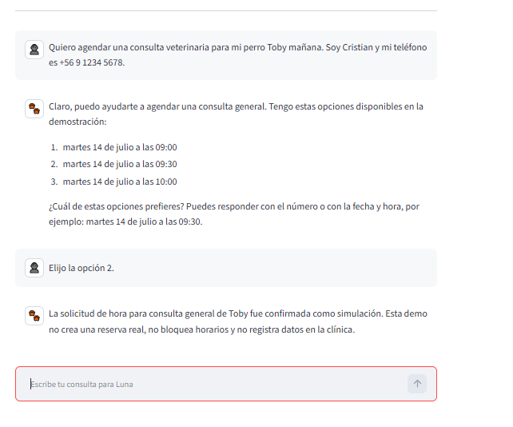
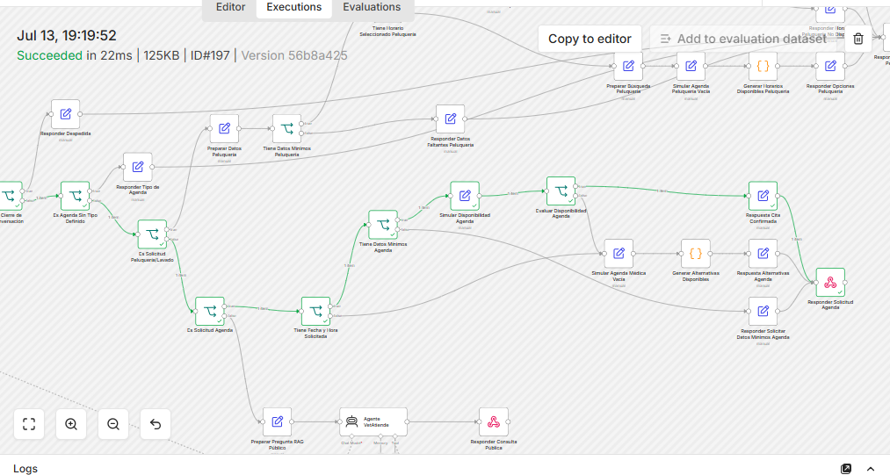
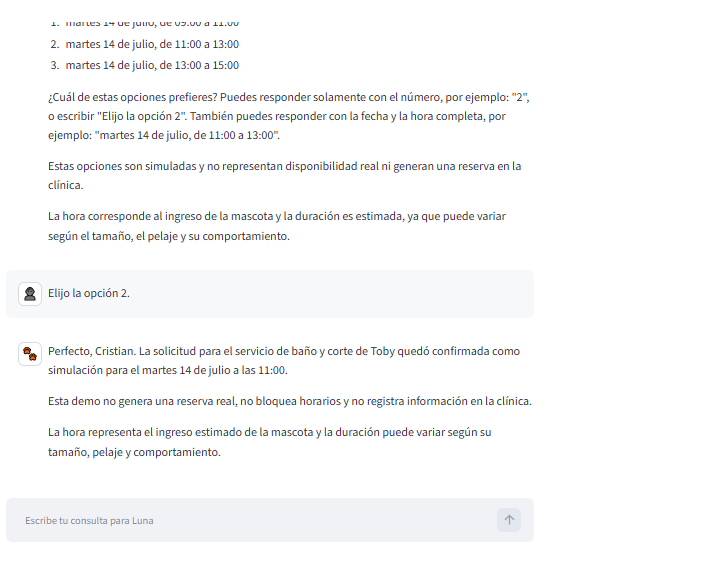
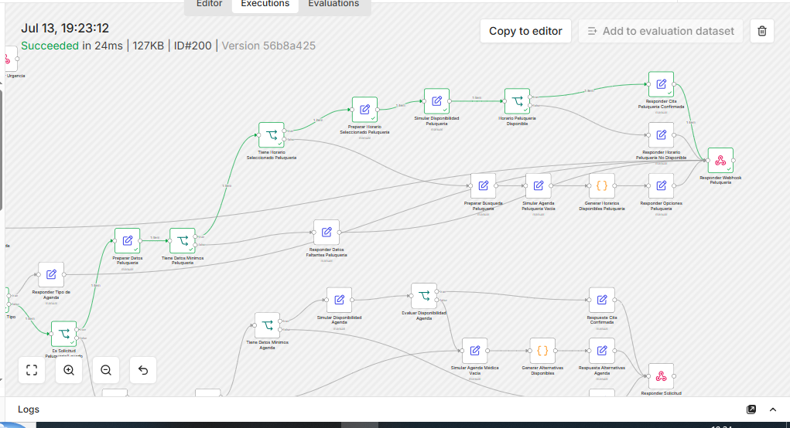
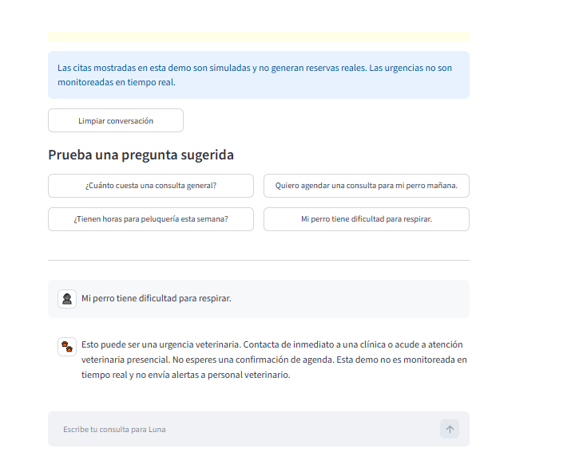
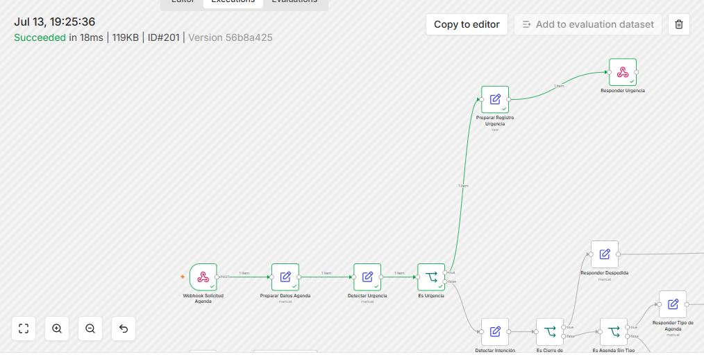

# LAB-016 - Checkpoint inicial de demo pública segura

**Fecha de inicio:** 2026-07-13
**Estado:** DOCUMENTACIÓN INICIAL COMPLETADA
**Implementación:** EN DESARROLLO
**Decisión asociada:** DA-029

## 1. Estado inicial

LAB-016 comienza después del cierre, validación y publicación oficial de LAB-015.

Estado del proyecto al iniciar:

- repositorio local limpio y sincronizado antes de comenzar LAB-016;
- rama principal `main`;
- MVP operativo desplegado en OCI;
- workflow público de producción activo;
- RAG público operativo;
- agenda médica operativa;
- agenda de peluquería y lavado operativa;
- Google Calendar y Google Sheets conectados al entorno operativo;
- alertas internas de urgencia mediante Telegram;
- interfaz Streamlit local funcional;
- continuidad conversacional de agenda validada;
- workflow publicado sanitizado y sin secretos.

El repositorio público permite revisar el código y la documentación, pero todavía no existe una URL pública para conversar con Luna.

## 2. Objetivo

Publicar una demo interactiva y segura de VetAtiende AI para que compañeros del bootcamp y evaluadores puedan conversar con Luna desde un navegador.

La demo debe mostrar las capacidades públicas principales del asistente sin permitir que usuarios externos produzcan efectos reales sobre la operación de la clínica.

El resultado esperado es:

- repositorio público disponible;
- URL pública funcional;
- interfaz clara y fácil de probar;
- conversación mantenida durante la sesión;
- modo interno completamente excluido;
- acciones de prueba aisladas de producción;
- documentación y evidencias completas.

## 3. Alcance de LAB-016

LAB-016 contempla:

- diseñar una interfaz exclusiva para la demo pública;
- crear `app/streamlit_public_app.py`;
- explicar claramente qué es VetAtiende AI;
- identificar a Luna como asistente virtual para clínicas veterinarias;
- mostrar las capacidades disponibles;
- incluir preguntas sugeridas;
- mantener el historial durante la sesión;
- permitir limpiar la conversación;
- mostrar una advertencia académica y veterinaria;
- conectar la interfaz a un webhook exclusivo de demostración;
- aislar citas, registros y urgencias de los recursos operativos;
- desplegar mediante Streamlit Community Cloud;
- configurar valores privados mediante Secrets;
- probar localmente antes de publicar;
- documentar las pruebas y evidencias;
- agregar la URL pública al README solamente después de validarla.

## 4. Contenido previsto de la interfaz

La pantalla pública deberá mostrar:

### Título

VetAtiende AI

### Subtítulo

Asistente virtual para clínicas veterinarias

### Descripción

> Luna ayuda a clientes de una clínica veterinaria a consultar servicios y precios, solicitar horas médicas o de peluquería y recibir orientación segura ante posibles urgencias.

### Capacidades disponibles

- consultar servicios, precios y horarios;
- solicitar una hora veterinaria;
- consultar peluquería y lavado;
- recibir orientación segura ante una posible urgencia.

### Preguntas sugeridas

- ¿Cuánto cuesta una consulta general?
- Quiero agendar una consulta para mi perro mañana.
- ¿Tienen horas para peluquería esta semana?
- Mi perro tiene dificultad para respirar.

### Advertencia

> Esta es una demo académica. Luna no realiza diagnósticos ni reemplaza la atención de un veterinario.

## 5. Separación entre demo y producción

La demo pública deberá estar aislada de los recursos operativos reales.

No se permitirá que compañeros, evaluadores ni usuarios externos:

- creen citas en el calendario médico operativo;
- creen citas en el calendario real de peluquería;
- agreguen registros en las planillas operativas;
- llenen hojas de solicitudes reales;
- generen alertas en la planilla real de urgencias;
- envíen falsas alertas al Telegram interno;
- accedan al webhook interno protegido;
- consulten documentación interna;
- utilicen el RAG interno;
- visualicen información operativa privada.

La demo tampoco deberá alterar ni requerir modificaciones directas en el workflow activo de producción antes de validar el aislamiento.

## 6. Exclusión total del modo interno

La interfaz pública no incluirá:

- selector de modo cliente o interno;
- formulario para claves internas;
- botones administrativos;
- acceso a procedimientos internos;
- conexión al webhook interno;
- llamadas al RAG interno;
- opciones destinadas al personal de la clínica.

La demo no deberá utilizar públicamente:

- `N8N_INTERNAL_WEBHOOK_URL`;
- `VETATIENDE_INTERNAL_KEY`;
- credenciales internas;
- claves privadas;
- tokens;
- identificadores externos privados;
- direcciones IP operativas visibles.

El modo interno continuará disponible solamente mediante sus canales privados y protegidos.

## 7. Arquitectura prevista

    Usuario público
    → Streamlit Community Cloud
    → app/streamlit_public_app.py
    → webhook exclusivo de demostración
    → reglas públicas y RAG público
    → agenda simulada o recursos exclusivos de demostración
    → orientación segura de urgencias sin Telegram real
    → respuesta de Luna

El entorno operativo continuará separado:

    Usuario o personal autorizado
    → interfaz local o canal privado
    → workflows operativos
    → Calendar y Sheets operativos
    → Telegram interno cuando corresponda

No deberá existir una conexión desde la aplicación pública hacia el modo interno.

## 8. Decisión técnica aprobada

Después de revisar `app/streamlit_app.py` y los riesgos del workflow operativo, se aprobó DA-030.

LAB-016 utilizará:

1. una aplicación Streamlit pública independiente;
2. un workflow n8n de demostración completamente separado;
3. agenda médica simulada;
4. agenda de peluquería y lavado simulada;
5. orientación segura de urgencias sin Telegram ni registros reales;
6. acceso exclusivo al RAG público.

Se descartó incorporar una rama demo dentro del workflow operativo porque una conexión o condición incorrecta podría ejecutar acciones reales.

También se descartó utilizar Calendar y Sheets de demostración durante LAB-016 porque agregarían credenciales, configuración y puntos de falla sin aportar una diferencia relevante para la evaluación académica.

El workflow demo deberá poder activarse, desactivarse o eliminarse sin afectar producción.

## 9. Agenda en modo demostración

La demo deberá permitir que el usuario pruebe una conversación de agenda.

Sin embargo, la confirmación no deberá crear una cita en los calendarios operativos.

Las alternativas técnicas que se evaluarán son:

- confirmación completamente simulada;
- calendario exclusivo para demostración;
- calendario temporal aislado;
- respuesta informativa sin persistencia externa.

La interfaz deberá indicar claramente cuando una cita sea simulada y no corresponda a una reserva real.

## 10. Urgencias en modo demostración

La demo continuará detectando mensajes que describan posibles urgencias veterinarias.

Luna deberá:

- advertir que puede tratarse de una urgencia;
- recomendar atención veterinaria inmediata;
- evitar diagnósticos;
- evitar tratamientos específicos;
- aclarar que la demo no es un canal atendido en tiempo real.

La demo no deberá:

- enviar mensajes al Telegram interno real;
- escribir en la hoja operativa de alertas;
- informar que un equipo humano fue notificado;
- simular falsamente una atención clínica activa.

## 11. Variables y secretos

La interfaz pública utilizará únicamente una configuración equivalente a:

- `N8N_DEMO_WEBHOOK_URL`

Esta variable deberá apuntar al webhook exclusivo de demostración.

En Streamlit Community Cloud deberá configurarse mediante Secrets.

No se deberá:

- subir el archivo `.env`;
- incluir URLs reales en el repositorio;
- escribir secretos directamente en Python;
- imprimir variables privadas en la interfaz;
- mostrar secretos en mensajes de error;
- reutilizar la clave del modo interno;
- publicar credenciales de n8n, Google o Telegram.

## 12. Archivos previstos

Los principales archivos previstos para LAB-016 son:

- `app/streamlit_public_app.py`;
- workflow sanitizado de demostración;
- documentación de la decisión técnica definitiva;
- evidencia de pruebas locales;
- evidencia de aislamiento;
- capturas de la interfaz pública;
- actualización del README con la URL validada.

Estos archivos todavía no se crean ni modifican en este checkpoint, salvo la documentación inicial de LAB-016.

## 13. Criterios de validación

LAB-016 solamente podrá cerrarse cuando:

- exista una URL pública funcional;
- la página explique claramente qué es VetAtiende AI;
- la página indique qué puede hacer Luna;
- las preguntas sugeridas funcionen;
- la conversación se mantenga durante la sesión;
- Luna responda consultas públicas;
- la agenda de demostración no cree citas reales;
- peluquería no cree citas reales;
- no se escriba en planillas operativas;
- las urgencias no envíen alertas reales;
- no exista acceso visible al modo interno;
- no exista conexión técnica con el webhook interno;
- no se expongan URLs privadas;
- no se expongan direcciones IP;
- no se expongan claves, tokens ni credenciales;
- el repositorio continúe sin archivos `.env`;
- el webhook demo pueda desactivarse sin afectar producción;
- las pruebas locales se completen antes del despliegue;
- el despliegue se valide antes de agregar la URL al README;
- la evidencia final quede documentada;
- el commit y push se realicen solamente después de validar.

## 14. Fuera de alcance

Queda fuera de LAB-016:

- convertir Streamlit en la aplicación comercial definitiva;
- publicar el modo interno;
- implementar autenticación empresarial;
- implementar usuarios y roles;
- implementar arquitectura multiempresa;
- conectar WhatsApp Business;
- ofrecer atención real de urgencias;
- reemplazar los workflows operativos actuales;
- modificar producción sin validación previa.

## 15. Restricciones de trabajo

Durante LAB-016 se mantendrán las siguientes reglas:

- avanzar en micro-pasos;
- documentar antes de implementar;
- explicar qué se modifica y por qué;
- ejecutar y verificar dentro del mismo paso;
- no tocar producción sin validar;
- no publicar antes de probar;
- no hacer commits intermedios sin validación;
- no exponer datos sensibles;
- usar Python cuando corresponda;
- mantener Git directo y breve;
- aprobar las decisiones arquitectónicas antes de ejecutarlas.

## 16. Estado del checkpoint

Quedan completados:

- DA-029 en `docs/decisiones_arquitectura.md`;
- actualización de LAB-016 en `docs/roadmap.md`;
- definición del objetivo;
- definición del alcance;
- separación obligatoria entre demo y producción;
- exclusión total del modo interno;
- arquitectura inicial prevista;
- criterios de validación.

Quedan pendientes:

- revisar `app/streamlit_app.py`;
- implementar la separación aprobada en DA-030;
- crear `app/streamlit_public_app.py`;
- probar localmente;
- preparar el webhook demo;
- validar aislamiento de Calendar, Sheets y Telegram;
- desplegar en Streamlit Community Cloud;
- agregar la URL pública al README;
- crear evidencias finales;
- commit y push.

**Resultado del checkpoint:** DOCUMENTACIÓN INICIAL COMPLETADA. INTERFAZ PÚBLICA LOCAL CREADA Y AISLADA. WORKFLOW DEMO PENDIENTE.
## 17. Validación local de la interfaz pública

Se creó la aplicación independiente:

- `app/streamlit_public_app.py`

La aplicación operativa existente:

- `app/streamlit_app.py`

permaneció sin modificaciones.

### Validaciones realizadas

Se comprobó:

- sintaxis Python válida;
- carga correcta de la interfaz mediante Streamlit;
- respuesta HTTP local correcta;
- funcionamiento en el puerto local 8502;
- título y subtítulo visibles;
- descripción de VetAtiende AI;
- capacidades públicas visibles;
- cuatro preguntas sugeridas;
- botón para limpiar la conversación;
- campo de chat;
- advertencia académica;
- advertencia sobre citas simuladas;
- advertencia sobre urgencias no monitoreadas;
- ausencia de selector de modo;
- ausencia de acceso interno;
- ausencia de claves o formularios internos.

La auditoría del código confirmó que la aplicación pública no contiene referencias a:

- `N8N_INTERNAL_WEBHOOK_URL`;
- `VETATIENDE_INTERNAL_KEY`;
- header interno;
- modo interno protegido;
- RAG interno.

### Hallazgo durante la primera prueba local

En la primera ejecución, la aplicación pública utilizaba la variable:

- `N8N_PUBLIC_WEBHOOK_URL`

Debido a que `load_dotenv()` cargó el archivo `.env` local existente, la aplicación tomó accidentalmente la URL del webhook público operativo.

La pregunta informativa:

- ¿Cuánto cuesta una consulta general?

recibió una respuesta real desde el workflow operativo.

No se probaron:

- agenda médica;
- peluquería;
- lavado;
- urgencias;
- creación de citas;
- registros en Google Sheets;
- alertas de Telegram.

La prueba fue detenida inmediatamente después de detectar la conexión.

No se identificaron efectos operativos derivados de la consulta informativa realizada.

### Corrección aplicada

Se reemplazó la variable de conexión de la aplicación pública por:

- `N8N_DEMO_WEBHOOK_URL`

Esta variable será exclusiva de LAB-016 y deberá apuntar únicamente al webhook demo separado.

También se actualizaron las referencias correspondientes en:

- `docs/decisiones_arquitectura.md`;
- `docs/evidencias/lab016_checkpoint_demo_publica_segura.md`.

La aplicación operativa conserva su configuración independiente.

### Validación del aislamiento

Antes de repetir la prueba se comprobó que `N8N_DEMO_WEBHOOK_URL` no estaba definida en:

- la sesión actual de PowerShell;
- el archivo `.env` local;
- un archivo local `.streamlit/secrets.toml`.

La aplicación pública se inició nuevamente sin configurar la variable demo.

Al seleccionar la pregunta sugerida sobre el precio de una consulta, la interfaz respondió de forma controlada:

> La demo todavía no tiene configurado su webhook. Revisa la configuración privada de la aplicación.

La aplicación no mostró:

- respuestas del workflow operativo;
- URLs;
- direcciones IP;
- excepciones de Python;
- detalles técnicos de `requests`;
- información sensible.

### Cierre de la prueba

Después de validar el aislamiento:

- se detuvo el proceso Streamlit;
- se eliminó el archivo PID temporal;
- se confirmó que el puerto 8502 quedó cerrado.

### Resultado

**VALIDADO:** la interfaz pública local funciona y está separada del webhook operativo.

La siguiente etapa será crear el workflow n8n demo completamente separado, sin Calendar, Sheets ni Telegram reales.

---

## 18. Validación integral desde Streamlit

**Fecha de validación:** 2026-07-13
**Estado:** VALIDADA LOCALMENTE

La interfaz pública `app/streamlit_public_app.py` fue conectada temporalmente al webhook permanente del workflow separado `LAB-016 - Demo pública segura`.

La URL del webhook se configuró únicamente mediante la variable de entorno temporal `N8N_DEMO_WEBHOOK_URL`. No fue escrita en el código fuente, archivos `.env`, evidencias ni repositorio.

### 18.1 Consulta pública con RAG

Pregunta validada:

> ¿Cuánto cuesta una consulta general?

Resultado:

- La solicitud llegó correctamente al workflow LAB-016.
- Luna respondió con el precio referencial de `$25.000 CLP`.
- La respuesta explicó qué incluye y qué no incluye la consulta general.
- No se activaron procesos operativos reales.

### 18.2 Agenda médica simulada

Conversación validada:

1. El usuario solicitó una consulta veterinaria para Toby.
2. Luna ofreció tres horarios de demostración.
3. El usuario respondió: `Elijo la opción 2`.
4. Luna conservó el contexto conversacional.
5. La solicitud fue confirmada explícitamente como simulación.

Resultado de seguridad:

- No se creó un evento en Google Calendar.
- No se bloqueó disponibilidad real.
- No se registraron datos en Google Sheets.
- No se generó una reserva real.

Evidencias:

### 18.3 Peluquería simulada

Conversación validada:

1. El usuario utilizó la pregunta sugerida de peluquería.
2. Luna solicitó tutor, mascota, teléfono, servicio, tamaño y día preferido.
3. El usuario entregó los datos de Toby y solicitó baño y corte.
4. Luna ofreció tres horarios simulados.
5. El usuario respondió: `Elijo la opción 2`.
6. Luna confirmó la solicitud como simulación.

Resultado de seguridad:

- No se consultó el calendario real de peluquería.
- No se creó una cita real.
- No se bloqueó disponibilidad.
- No se registró información en Google Sheets.

Evidencias:

### 18.4 Urgencia veterinaria segura

Pregunta validada:

> Mi perro tiene dificultad para respirar.

Resultado:

- Luna detectó correctamente una posible urgencia veterinaria.
- Recomendó atención veterinaria presencial inmediata.
- Indicó que no se debía esperar una confirmación de agenda.
- Informó que la demo no está monitoreada en tiempo real.
- Informó que no se envían alertas al personal veterinario.

Resultado de seguridad:

- No se registró la alerta en Google Sheets.
- No se envió un aviso por Telegram.
- No se ofrecieron horarios.
- No se simuló una atención veterinaria.

Evidencias:

### 18.5 Exportación segura del workflow

El workflow LAB-016 fue exportado como:

`n8n/workflows/lab016_vetatiende_demo_publica_segura.json`

Resultado de la validación automática:

- Nombre: `LAB-016 - Demo pública segura`
- Estado exportado: inactivo
- Cantidad de nodos: 46
- Nodos Google Calendar, Google Sheets o Telegram: 0
- Credenciales incorporadas: 0
- Identificadores privados de webhook: 0
- URLs encontradas: 0
- Direcciones IP encontradas: 0
- Correos electrónicos encontrados: 0

El workflow exportado puede publicarse en GitHub sin exponer credenciales, direcciones privadas ni integraciones operativas.

### 18.6 Resultado de la validación local

Las cuatro capacidades públicas quedaron validadas desde Streamlit:

- consulta pública mediante RAG;
- agenda médica simulada;
- peluquería simulada;
- orientación segura ante urgencias.

La demo LAB-016 permanece separada del MVP operativo. No reemplaza el workflow LAB-010 ni la interfaz operativa `app/streamlit_app.py`.

**Conclusión:** la implementación local de la demo pública segura quedó validada. El paso siguiente es su publicación en Streamlit Community Cloud.

---

## 19. Validación pública en Streamlit Community Cloud

**Fecha de validación:** 2026-07-13
**Estado:** VALIDADA PÚBLICAMENTE

La aplicación pública fue desplegada desde el repositorio GitHub mediante Streamlit Community Cloud.

**URL pública:**

[https://vetatiende-ai-nwg6exgqvha5zst2fyvpxw.streamlit.app/](https://vetatiende-ai-nwg6exgqvha5zst2fyvpxw.streamlit.app/)

El archivo principal utilizado para el despliegue fue:

`app/streamlit_public_app.py`

La conexión con n8n se configuró mediante el secreto privado:

`N8N_DEMO_WEBHOOK_URL`

La URL del webhook no fue incorporada al código fuente, al README ni al repositorio.

### 19.1 Consulta pública mediante RAG

Se validó desde la URL pública la pregunta:

> ¿Cuánto cuesta una consulta general?

Resultado:

- Luna respondió con el precio referencial de `$25.000 CLP`.
- Explicó qué incluye y qué no incluye la consulta.
- La ejecución llegó correctamente a `LAB-016 - Demo pública segura`.
- No se ejecutó el workflow operativo LAB-010.

### 19.2 Agenda médica simulada

Se validó la conversación:

1. `Quiero agendar una consulta para mi perro mañana.`
2. Luna ofreció tres opciones simuladas.
3. Luna solicitó tutor, mascota y teléfono.
4. El usuario respondió con la opción 2 y los datos de Cristian Torres y Toby.
5. Luna confirmó la solicitud como simulación.

Resultado de seguridad:

- No se creó una reserva real.
- No se bloqueó disponibilidad.
- No se registraron datos en Google Sheets.
- No se creó un evento en Google Calendar.

Durante esta validación se detectó que la palabra `mañana` podía interpretarse erróneamente como nombre de mascota. El extractor `nombreMascota` fue corregido para rechazar palabras temporales y continuar buscando nombres válidos dentro del mensaje actual y del contexto conversacional.

La corrección fue publicada en n8n y validada nuevamente con resultado correcto:

- `mañana` dejó de ser interpretado como nombre;
- `Toby` fue reconocido correctamente;
- la selección `Elijo la opción 2` conservó el contexto.

### 19.3 Peluquería simulada

Se validó desde la aplicación pública:

1. la pregunta sugerida sobre horas de peluquería;
2. la solicitud de tutor, mascota, teléfono, servicio, tamaño y día;
3. el reconocimiento de Cristian Torres y Toby;
4. el servicio de baño y corte;
5. la generación de tres horarios simulados;
6. la selección de la opción 2;
7. la confirmación simulada para las 11:00.

Resultado de seguridad:

- No se consultó disponibilidad real.
- No se creó una cita real.
- No se bloquearon horarios.
- No se registraron datos en la clínica.

### 19.4 Urgencia veterinaria segura

Se validó desde la aplicación pública:

> Mi perro tiene dificultad para respirar.

Resultado:

- Luna detectó una posible urgencia veterinaria.
- Recomendó atención veterinaria presencial inmediata.
- Indicó que no se debía esperar una confirmación de agenda.
- Informó que la demo no está monitoreada en tiempo real.
- Informó que no se envían alertas al personal veterinario.

Resultado de seguridad:

- No se envió una alerta por Telegram.
- No se registró una urgencia en Google Sheets.
- No se ofrecieron horarios.
- No se simuló atención clínica.

### 19.5 Resultado final del despliegue

Las cuatro capacidades públicas quedaron validadas desde Internet:

- consulta pública mediante RAG;
- agenda médica simulada;
- peluquería simulada;
- orientación segura ante urgencias.

La demo pública permanece separada del MVP operativo y no tiene acceso al modo interno protegido.

**Conclusión:** la demo pública segura de VetAtiende AI quedó desplegada y validada correctamente en Streamlit Community Cloud.
